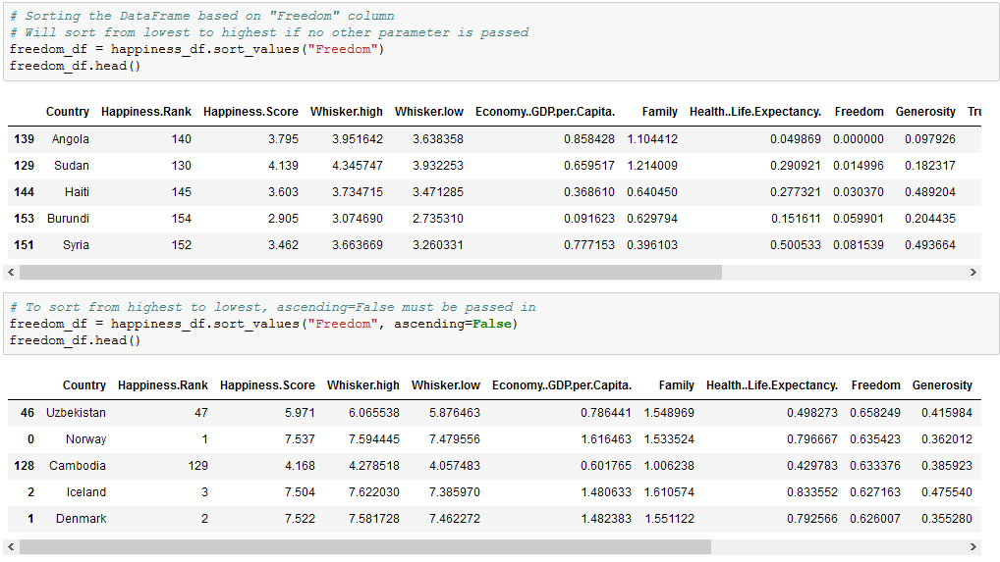
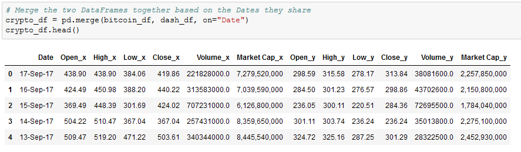

## 4.2 Lesson Plan - Exploring Pandas

### Overview

Today's lesson takes dives deeply into Pandas and covers some of the library's more complex functions - like grouping, merging, and binning - whilst solidifying the concepts from the last class.

- - -

### Class Objectives

* Students should understand how to create and access Pandas GroupBy objects
* The class should understand how to sort DataFrames
* Students should know how to merge DataFrames together whilst understanding the differences between inner, outer, left, and right merges
* The class should be able to slice data using the `cut()` method and create new values based upon a series of bins

- - -

### 1. Everyone Do: Pandas Recap and DataTypes (0:10)

* Before diving into any new material for the day, the class will first delve into a recap of what has been covered in Pandas thus far.

* Open up and slack out the unsolved version of [01-PandasRecap](Activities/01-Evr_PandasRecap/Unsolved/PandasRecap.ipynb) along with [ufoSightings.csv](Activities/01-Evr_PandasRecap/Resources/ufoSightings.csv).

  * Go through the cells within the unsolved version of the Jupyter Notebook, having the class assist in creating the code that would accomplish the tasks listed within the comments.

  * If there is ever a moment in which your class seems to be struggling, feel free to refer to the solved version of [01-PandasRecap](Activities/01-Evr_PandasRecap/Solved/PandasRecap.ipynb) in order to help keep the class on track.

  * Upon reaching the final cell, let the class know that this DataFrame has a small problem. The majority of the columns - even those that are purely numeric - are being stored as objects.

  * A list of a DataFrame's datatypes can be seen by accessing its `dtypes` property

    

  * This means that it is currently impossible to perform any form of calculation on the "Duration (Seconds)" column at this time. Luckily Pandas includes a way in which to change a column's data type easily.

* In order to change a non-numeric column to a numeric column, simply run the `pd.to_numeric()` method and pass the Series in as a parameter.

    

    * It is also possible to set the datatype of every column within a DataFrame by using the `df.astype(<datatype>)` and passing in the Python datatype desired as the parameter.

### 2. Instructor Do: Pandas Grouping (0:10)

* In the last activity, the class created a DataFrame which contained the sum of UFO sightings in each state. This acted as a kind of summary table but does not include other interesting datapoint. For example: it does not contain the number of seconds UFOs were sighted for within each state.

  * While it would be possible to collect and calculate the sum of seconds for each state through the ample use of `.loc[]` filtering, there is a far simpler method that would cut down on time immensely.

* Open up [02-Ins_GroupBy](Activities/02-Ins_GroupBy/GroupBy.ipynb) within Jupyter Notebook and run through the code with the class, explaining it cell-by-cell.

  * The start to the code is much the same as earlier. Import in dependecies, remove all rows with missing data, convert the "duration (seconds)" column to numeric, filter the DataFrame so only US info is shown, and count the number of sightings per state.

  * The `df.groupby([<Columns>])` method is then used in order to split the DataFrame into multiple groups with each group being a different state within the US.

  * The object returned by the `.groupby()` method is a GroupBy object and cannot be accessed like a normal DataFrame. In fact, one of the only ways in which to access values within a GroupBy object is by using a data function on it.

    

  * It is possible to create new DataFrames using purely GroupBy data. This can by done by taking the `pd.DataFrame()` method and passing the GroupBy data desired in as the parameter.

  * A DataFrame can also be created by selecting a single series from a GroupBy object and passing it in as the values for a specified column.

    

  * It is possible to perform a `df.groupby()` method on multiple columns as well. This can be done by simply passing two or more column references into the list parameter.

    

### 3. Partners Do: Building a PokeDex (0:20)

* Students will now take some time to create a DataFrame that visualizes the average stats for each type of Pokemon from the popular video game series. They will do so using the `GroupBy()` method and then converting their findings into a DataFrame.

* Open up the solved version of [03-Par_Pokemon](Activities/03-Par_Pokemon/Solved/pokemon.ipynb) within Jupyter Notebook in order to show students what the final version of their application should look like.

  

* **Files:**

  * [Pokemon.csv](Activities/03-Par_Pokemon/Resources/Pokemon.csv)

* **Instructions:**

  * Read the Pokemon CSV file with Pandas.

  * Create a new table by extracting the following columns: "Type 1", "HP", "Attack", "Sp. Atk", "Sp. Def", and "Speed".

  * Find the average stats for each type of Pokemon.

  * Create a new DataFrame out of the averages.

  * calculate the total power level of each type of pokemon by adding all of the previous stats together and place the results into a new column.

* **Bonus:**

  * Sort the table by strongest type and export the resulting table to a new CSV

### 4. Everyone Do: Building a PokeDex Review (0:05)

* Open up the solved version of [03-Par_Pokemon](Activities/03-Par_Pokemon/Solved/pokemon.ipynb) within Jupyter Notebook and work through the code with the class, making certain to cover the following points...

  * The original dataset is read into a Pandas DataFrame and is then cut down so that only the "Type 1" and stat columns remain.

  * The DataFrame is then grouped according to the values contained within the "Type 1" column and the averages for each type are then calculated using the `df.mean()` method.

    

  * A new DataFrame is then created using the GroupBy object returned by `pokemon_group.mean()` and the totals for each type of pokemon is calculated by adding up the values in each row before placing them into a newly created "Totals" column.

    

* Answer whatever questions the class may have before moving onto the next activity.

### 5. Instructor Do: Sorting Made Easy (0:05)

* Within the last activity's bonus, students were asked to sort their final table by which type of pokemon was strongest. While the solution to this problem could be uncovered rather simply through some applied "Google-Fu", there are some quirks to sorting which should be covered.

* Open up [04-Ins_Sorting](Activities/04-Ins_Sorting/Sorting.ipynb) within Jupyter Notebook and run through the code with the class, discussing it cell-by-cell.

  * The data being used here is the 2017 world happiness rankings and, while they have already been sorted from most happy to least happy, it is possible to sort this dataset using the values in different columns.

  * In order to sort a DataFrame based upon the values within a column, simply use the `df.sort_values()` method and pass the column name to sort by in as a parameter.

  * The parameter of "ascending" is always marked as True by default. This means that the `sort_vales()` method will always sort from lowest to highest unless the parameter of `ascending=False` into passed into the `sort_values()` method as well.

    

  * Something immensely helpful when dealing with sorted DataFrames is the `df.reset_index()` method. This method will recalculate the index for each row based upon their position within the new DataFrame and, as such, will allow for far simpler referencing of rows in the future.

  * Passing `drop=True` into `df.reset_index()` will ensure no new column is created when the index is reset.

  * It is possible to sort based upon the values stored within multiple columns by passing a list of columns into the `sort_values()` method as a parameter. The first column will be the primary sorting method with ties being broken by the second column.

### 6. Students Do: Search For the Worst (0:15)

* Students will now take a dataset composed of soccer player statistics and will attempt to determine which players are the worst in the world at their particular position.

* Open up the solved version of [05-Stu_SearchForTheWorst](Activities/05-Stu_SearchForTheWorst/Solved/SearchForTheWorst.ipynb) within Jupyter Notebook in order to show students what the final version of their application should look like.

  

* **Files:**

  * [Soccer2018Data.csv](Activities/05-Stu_SearchForTheWorst/Resources/Soccer2018Data.csv)

* **Instructions:**

  * Read in the CSV file provided and print it to the screen

  * Print out a list of all of the values within the "Preferred Position" column

  * Select a value from this list and create a new DataFrame that only includes players who prefer that position

  * Sort the DataFrame based upon a player's skill in that position

  * Reset the index for the DataFrame so that the index is in order

  * Print out the statistics for the worst player in a position to the screen

### 7. Everyone Do: Search For the Worst Review (0:05)

* Open up [05-Stu_SearchForTheWorst](Activities/05-Stu_SearchForTheWorst/Solved/SearchForTheWorst.ipynb) within Jupyter Notebook and run through the code with the class, discussing it cell-by-cell.

  * To collect a list of all the positions players prefer to play in, the `unique()` method is run on the "Preferred Position" column within the DataFrame.

  * To filter in only those players that play in a particular position, use `df.loc()` and have it collect only those rows where "Preferred Position" is equal to the position desired.

  * To sort the values within the new DataFrame from lowest to highest, simply run the `df.sort_values()` method, pass the position column to sort by, and then make sure that `ascending = True`. This final step should be completed by default without having to be entered.

    

### 8. Instructor Do: Merging DataFrames (0:10)

* Sometimes the data an analyst is provided with is split into multiple parts. This, of course, is not an ideal situation as it is far more preferable to work with a single dataset than it is to work with a bunch of different datasets.

  * This is where the concept of merging comes into play, as Pandas allows its users to quite easily combine separate DataFrames on similar values using the `pd.merge()` method.

* Open up [06-Ins_Merging](Activities/06-Ins_Merging/Merging.ipynb) within Jupyter Notebook and run through the code with the class, discussing it cell-by-cell.

  * The first chunks of code are used to create two DataFrames which contain information on customers and the purchases they have made.
  
  * Make sure to point out how these two DataFrames share the "customer_id" column in common. This will be very important soon.

  * In the final chunk of code, the `pd.merge()` method is used and three parameters are passe into it: references to both of the DataFrames and the value `on="customer_id"`.

  * This code tells the computer to combine the two DataFrames together so that, whenever the "customer_id" column matches, the rows containing the matching data are joined.

    

  * This is what is known as an inner join. Inner joins are the default means through which DataFrames are combined using the `pd.merge()` method and will only return data whose values match. Any rows that do not include matching data will be dropped from the combined DataFrame.

  * The opposite of an inner join is an outer join. Outer joins will combine the DataFrames regardless of whether any of the rows match and must be declared as a parameter within the `pd.merge()` method using the syntax `how="outer"`.

    

  * Any rows that do not include matching data will have the values within replaced with `NaN` instead.

  * There are also right and left joins. These joins will protect the data contained within one DataFrame like an outer join does whilst also dropping the rows with null data from the other DataFrame.

    

### 9. Students Do: Cryptocurrency Merging (0:20)

* Students will now take some time to merge together two datasets on cryptocurrencies, one on Bitcoin and the other on Dash. They will then clean up the combined DataFrame to make it more presentable.

* Open up the solved version of [07-Stu_Cryptocurrency](Activities/07-Stu_Cryptocurrency/Solved/Cryptocurrency.ipynb) within Jupyter Notebook in order to show students what the final version of their application should look like.

  

* **Files:**

  * [bitcoin_cash_price.csv](Activities/07-Stu_Cryptocurrency/Resources/bitcoin_cash_price.csv)

  * [dash_price.csv](Activities/07-Stu_Cryptocurrency/Resources/dash_price.csv)

* **Instructions:**

  * Read in both of the CSV files and print out their DataFrames

  * Perform an inner merge that combines both DataFrames on the "Date" column

  * Rename the columns within the newly merged DataFrame so that the headers are more descriptive

  * Create a summary table that includes the following information: `Best Bitcoin Open`, `Best Dash Open`, `Best Bitcoin Close`, `Best Dash Close`, `Total Bitcoin Volume`, `Total Dash Volume`

  * `Total Bitcoin Volume` and `Total Dash Volume` should be calculated to have units of "millions" and be rounded to two decimal places

### 10. Everyone Do: Cryptocurrency Merging Review (0:05)

* Open up [07-Stu_Cryptocurrency](Activities/07-Stu_Cryptocurrency/Solved/Cryptocurrency.ipynb) within Jupyter Notebook and run through the code with the class, discussing it cell-by-cell.

  * Once the two DataFrames have been merged, the column headers are messed up. This is because the columns within the first DataFrame match those within the second and Pandas feels the need to differentiate them somehow. This also means the columns need to be renamed manually.

    

  * To find the total volumes for Bitcoin and Dash, our code divides the sum of their columns by one million and then rounds the returned value to the nearest two decimal places.

  * The values for our summary DataFrame are held within brackets because, without them, Pandas would have difficulties understanding that all of these values should be held within the same row.

    

### 11. BREAK (0:20)

### 12. Instructor Do: Binning Data (0:05)

* Not everyone is a numbers person and sometimes there are so many values within a DataFrame that it becomes very difficult to comprehend what exactly is going on. For this reason, Pandas has a built-in "binning" method that allows its users to place values into groups so as to allow for more vigorous customization of datasets.

* Open up [08-Ins_Binning](Activities/08-Ins_Binning/Binning.ipynb) within Jupyter Notebook and run through the code with the class, discussing it cell-by-cell.

  * When using the `pd.cut()` method, three parameters must be passed in. The first is the Series that is going to be cut. The second is a list of the bins that the Series will be sliced into. The last is a list of the names/values that will be given to the bins.

  * It is important to note how, when creating the list for bins, Pandas will automatically determine the range between values. This means that, when given the list `[0, 25, 50, 75, 100]`, Pandas will create four bins with ranges between those values in the list.

  * The labels for the `pd.cut()` method must have an equal length to the number of bins. If there are too many or too few, an error will be returned.

    

  * What makes binning so powerful is that, after creating and applying these bins, the DataFrame can be grouped according to those values and thus a higher-level analysis can be conducted.

    

### 13. Students Do: Binning TED (0:20)

* The class will now put their binning skills to the test by creating bins for TED Talks based upon their viewership. After creating the bins, they will then group the DataFrame based upon those bins and perform some analysis on them.

* Open up the solved version of [09-Stu_TedTalks](Activities/09-Stu_TedTalks/Solved/BinningTed.ipynb) within Jupyter Notebook in order to show students what the final version of their application should look like.

  

* **Files:**

  * [ted_talks.csv](Activities/09-Stu_TedTalks/Resources/ted_talks.csv)

* **Instructions:**

  * Read in the CSV file provided and print it to the screen

  * Find the minimum "views" and maximum "views"

  * Using the minimum and maximum "views" as a reference, create 10 bins in which to slice the data

  * Create a new column called "View Group" and fill it with the values collected through your slicing

  * Group the DataFrame based upon the values within "View Group"

  * Find out how many rows fall into each group before finding the averages for "comments", "duration", and "languages"

### 14. Everyone Do: Binning TED Review (0:05)

* Open up [09-Stu_TedTalks](Activities/09-Stu_TedTalks/Solved/BinningTed.ipynb) within Jupyter Notebook and run through the code with the class, discussing it cell-by-cell.

  * Since the values contained within the "views" column are so widespread, there are several ways in which to split up the data that would be acceptable. This particular code uses a variable scale that attempts to look at every 200k view difference until reaching the millions, at which point it switches to look at every 1mil difference.

    

  * The bins are added into the DataFrame by simply placing them within a new column. The DataFrame is then grouped on this new column in order to perform all of the Data Functions.

### 15. Instructor Do: Mapping (0:05)

* Students may recall how Excel's number formats allows its users to change the styling of columns without much effort. Pandas also includes this functionality through its `df.map()` method, thus allowing users to style columns wholesale.

* Open up [10-Ins_Mapping](Activities/10-Ins_Mapping/Mapping.ipynb) within Jupyter Notebook and run through the code with the class, discussing it cell-by-cell.

  * `df[<COLUMN>].map(<FORMAT STRING>.format)` is the method by which users can modify the styling of an entire column.

  * The formatting syntax used for mapping is, in a word, confusing. It uses strings containing curly brackets in order to determine how to style columns and this can make it rather difficult to understand at first glance.

  * A somewhat easy way to understand mapping strings is that it is almost akin to concatenating strings. Whatever is outside of the curly brackets is added before/after the initial value which is modified by whatever is contained within the curly brackets.

  * So, to convert values into a typical dollar format, one would use `"${:.2f}"`. This places a dollar sign before the value which has been rounded to two decimal points.

  * Using `"{:,}"` will split a number up so that it uses comma notation. For example: the value `2000` would become `2,000` using this format string.

    

  * Format mapping only really works once and will return errors if the same code is run multiple times without restarting the kernel. Because of this, formatting is usually applied near the end of an application.

  * Format mapping also can change the datatype of a column. As such, all calculations should be handled before modifying the formatting.

    

### 16. Partners Do: Cleaning Kickstarter (0:25)

* The class will now spend the remainder of the lesson flexing their Pandas muscles by taking a dataset similar to that of their first homework, cleaning it up, and formatting it in far less time than it would take in Excel.

* Open up the solved version of [11-Stu_CleaningKickstarter](Activities/11-Stu_CleaningKickstarter/Solved/KickstarterClean.ipynb) within Jupyter Notebook in order to show students what the final version of their application should look like.

* **Files:**

  * [KickstarterData.csv](Activities/11-Stu_CleaningKickstarter/Unsolved/Resources/KickstarterData.csv)

  * [KickstarterClean.ipynb](Activities/11-Stu_CleaningKickstarter/Unsolved/KickstarterClean.ipynb)

* **Instructions:**

  * The instructions for this activity are contained within the Jupyter Notebook.

### 17. Everyone Do: Cleaning Kickstarter Review (0:05)

* Open up [11-Stu_CleaningKickstarter](Activities/11-Stu_CleaningKickstarter/Solved/KickstarterClean.ipynb) within Jupyter Notebook and run through the code with the class, discussing it cell-by-cell.

- - -

### Copyright

Coding Boot Camp © 2017. All Rights Reserved.
